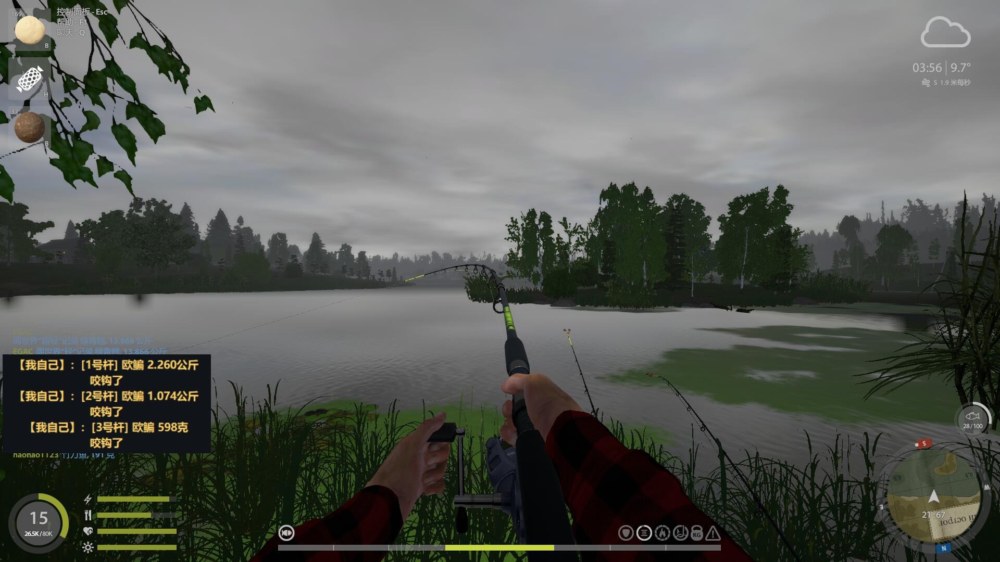

# RF4 Monitor

RF4 Monitor 是一个 `俄罗斯钓鱼4`游戏的网络流量监控工具，用于本地代理 RF4 的登录 HTTPS 和 realtime TCP 流量，解析游戏业务数据，并在控制台输出更易读的中文信息。

为了不破坏游戏实际体验，本工具仅实现了提前"窥探"当前服务端下发的鱼的信息功能。

## 主要功能

- 自动接管 `api.rf4game.ru` 登录域名
- 自动解析登录包中的 realtime 服务器地址和端口
- 自动把登录返回的 realtime 地址改写到本地监听端口
- 继续代理真实 realtime TCP 业务流量
- 解析 RF4 应用层协议数据
- 输出频道鱼获信息（其他玩家钓到/记录鱼）
- 输出自己钓鱼全流程提示：来鱼、脱钩、入护、放生
- 桌面浮窗提醒：自己来鱼/脱钩/入护/放生时弹出置顶提示（可拖动、记忆位置）
- 浮窗 F8 挂起/恢复游戏进程（支持倒计时自动循环）
- 输出人物坐标、钓组坐标、搏鱼状态、公共聊天等监控信息

## 目录文件

```text
rf4_monitor-main/
  deskmon.bat             双击启动托盘（自提权，后台运行无控制台）
  rf4_core/               核心实现包（入口、逻辑、配置、数据、测试全部在此）
    engine.py             mitmdump addon + CLI 主入口
    tray.py               系统托盘控制（一键启动/停止监控 + 浮窗）
    overlay.pyw           来鱼浮窗提醒（UDP 事件桥监听端）
    web_monitor.py        浏览器端监控面板（可选）
    launcher.py           CLI、hosts、证书、mitmdump 命令、登录改写
    protocol.py           协议编解码、数据类、协议 profile
    sniffer.py            RC4 嗅探器、TCP 重组、Hermes 会话
    game_catalog.py       游戏内物品目录加载
    fish_labels.py        鱼名中文映射加载
    process_control.py    游戏进程挂起/恢复控制
    console.py            终端着色辅助
    bridge.py             RF4ChatBridge（mitmdump addon）、FlowSession、事件桥
    catalog/              装备目录索引
    fish_labels_zh.json   鱼名中文映射
    rf4_config.json       主配置（协议 profile、抓包模式、服务器地址）
    rf4_mode.json         监控模式（proxy / passive）
    rf4_hosts.txt         hosts 示例
    reference_defaults.txt 默认网络参考配置
    tests/                单元测试
      protocol/           协议编解码测试
      bridge/             事件桥测试
      sniffer/            嗅探器测试
      overlay/            浮窗测试
  安装依赖.bat            Python 依赖安装脚本，使用清华源
  requirements.txt        Python 依赖列表
```

> 命名说明：入口脚本、托盘、浮窗统一使用中性代号 **DeskMon**（进程名、互斥量、环境变量均不含 rf4 字样），浮窗窗口标题为「来鱼提示」，避免被游戏进程扫描注意到。`rf4_core/` 内部包与 `rf4_*.json` 配置为磁盘文件，保留原名不影响。

证书文件由启动流程自动生成，保存在本机 `certs/` 目录：

```text
certs/rf4_monitor.crt
```

## 安装

### 1. 安装 Python 3

安装 Python 3.9 或更高版本。Windows 安装时建议勾选：

```text
Add Python to PATH
```

安装完成后，打开 `cmd` 检查：

```bat
py -3 --version
pip3 --version
```

如果命令不存在，重新安装 Python，并确认已勾选 `Add Python to PATH`。

### 2. 安装 Python 依赖

进入工具目录：

```bat
cd /d tools\rf4_monitor
```

双击运行：

```text
安装依赖.bat
```

也可以手动执行：

```bat
pip3 install -r requirements.txt -i https://pypi.tuna.tsinghua.edu.cn/simple --trusted-host pypi.tuna.tsinghua.edu.cn
```

当前依赖主要是：

```text
mitmproxy>=9,<10
pystray>=0.19
Pillow>=10.0
```

### 3. 导入自签证书

RF4 登录 HTTPS 流量需要本地证书。证书文件位于：

```text
certs\rf4_monitor.crt
```

如果 `certs\rf4_monitor.crt` 不存在，先运行一次：

```bat
py -3 deskmon_engine.py --prepare-only
```

导入方式一：图形界面导入

1. 双击 `certs\rf4_monitor.crt`
2. 点击 `安装证书`
3. 选择 `本地计算机`
4. 选择 `将所有的证书都放入下列存储`
5. 选择 `受信任的根证书颁发机构`
6. 完成导入

导入方式二：管理员命令导入

```bat
certutil -addstore Root certs\rf4_monitor.crt
```

证书导入后，再以管理员身份运行 `deskmon.bat`。

## 启动

### 方式一：托盘一键启停（推荐，含浮窗，无控制台窗口）

1. 关闭 RF4
2. 右键以管理员身份运行 `deskmon.bat`（或在资源管理器中双击，会自动请求提权）
3. 系统托盘出现 RF4 图标后，右键菜单选择 **启动监控**
4. 等待 `logs\rf4_monitor.log` 出现监听信息（会同时启动桌面浮窗）
5. 启动 RF4 并登录游戏
6. 来鱼/脱钩/入护/放生时浮窗会弹提示，日志写入 `logs\rf4_monitor.log`

停止：托盘右键菜单选择 **停止监控**（会自动恢复 hosts 并结束主程序与浮窗）。

彻底退出：托盘右键菜单选择 **退出**。

### 方式二：命令行仅主程序

```bat
py -3 deskmon_engine.py
```

等待控制台出现监听信息后启动 RF4 并登录游戏。

管理员权限通常是必须的，因为程序需要：

- 修改 Windows hosts
- 监听 `443` 和 realtime 业务端口

## 浮窗提醒

`deskmon_overlay.pyw` 是一个独立的桌面浮窗，通过 UDP 事件桥（默认 `127.0.0.1:25000`）接收主程序广播的自己钓鱼事件：

- **来鱼**：`【我自己】： 有太阳鱼 138克 过来了`
- **脱钩**：`【我自己】： 太阳鱼 挣脱跑了（脱钩）`
- **入护**：`【我自己】： 有太阳鱼 138克 入护了`
- **放生**：`【我自己】： 放生了 太阳鱼`

浮窗只显示自己的鱼获事件，其他玩家的钓到/记录消息不会弹出。浮窗为透明置顶小窗，可按住左键拖动到任意位置，位置会自动记忆在 `rf4_overlay_config.json`。

### 游戏进程挂起

浮窗运行时注册全局 F8 热键。第一次按 F8 会挂起 `rf4_x64.exe`，倒计时结束后自动恢复，短暂延迟后再次挂起；再按 F8 立即恢复。参数在 `rf4_core/rf4_config.json`：

```json
"process_suspend": {
  "enabled": true,
  "process_names": ["rf4_x64.exe"],
  "loop_enabled": true,
  "countdown_seconds": 120,
  "rehang_delay_seconds": 2
}
```

停止或关闭浮窗不会自动恢复游戏进程；需要手动恢复时，先按 F8 再退出。

浮窗可单独运行（不依赖主程序启动脚本）：双击 `deskmon_overlay.pyw`。若端口被占用会提示已有实例在运行。

### 手机网页监控

托盘菜单里的 **手机网页监控** 会在本机启动 HTTP 服务，手机浏览器访问 `http://<电脑IP>:8088` 即可查看浮窗事件历史。服务监听局域网地址，同一 WiFi 内的其他设备也能访问。

## 截图



## 默认行为

正常启动时不需要额外参数。程序会自动完成：

- 扫描参考流量，提取 RF4 域名和 realtime 地址
- 使用 `reference_defaults.txt` 作为兜底网络配置
- 更新 Windows hosts
- 准备本地证书
- 启动 mitmdump
- 监听登录 HTTPS 端口
- 监听 realtime TCP 端口
- 改写登录包里的 realtime 地址
- 解析并打印业务数据

## 输出示例

```text
feide3383 钓到了 63 克 欧鲌
RF4-3D 记录[底钓] 钓到了 1.384 公斤 金眼狼鲈
【我自己】： 有鲈鱼 262 克 过来了
【我自己】： 鲈鱼 挣脱跑了（脱钩）
【我自己】： 有鲈鱼 262 克 入护了
【我自己】： 放生了 欧鲌
人物坐标 =(368.702,16.208,444.658)
钓鱼过程位置上报 | 钓组=497bae49... 钓组坐标=(-132.041,0.597,-55.398)
```

浮窗对应显示：

```text
【我自己】： 有鲈鱼 262 克 过来了
【我自己】： 鲈鱼 挣脱跑了（脱钩）
【我自己】： 有鲈鱼 262 克 入护了
【我自己】： 放生了 欧鲌
```

默认不会输出下面这类协议调试前缀：

```text
[RF4业务/钓鱼] 客户端->服务器 请求#40 协议14/7
```

## 常用命令

关闭业务遥测，只看鱼获和自己来鱼：

```bat
py -3 deskmon_engine.py --set rf4_log_telemetry=false
```

只看钓鱼相关信息：

```bat
py -3 deskmon_engine.py --set rf4_telemetry_categories=fish
```

只更新 hosts：

```bat
py -3 deskmon_engine.py --update-hosts-only
```

## hosts

Windows hosts 路径：

```text
C:\Windows\System32\drivers\etc\hosts
```

最小示例：

```text
127.0.0.1 api.rf4game.ru
```

程序会自动维护 `RF4 MONITOR` 托管块，并在修改前备份原 hosts 文件。

## 常见问题

`Permission denied`

- 请使用管理员身份运行 `deskmon.bat` 或命令行 `py -3 deskmon_engine.py`

`Cannot spawn multiple servers on the same address: *:443`

- `443` 端口已被占用
- 关闭占用程序或检查是否重复启动了 RF4 Monitor

启动后只监听 `8080`

- 没有提取到 RF4 域名或 realtime 地址
- 确认 `reference_defaults.txt` 存在
- 确认当前目录文件完整

能登录但没有业务解析输出

- 确认登录日志里出现 `rewrote login realtime target`
- 确认 realtime TCP 连接进入 RF4 Monitor
- 可临时开启详细日志：

```bat
py -3 deskmon_engine.py --set rf4_verbose_logging=true
```

如果游戏版本升级，需要重新确认协议字段、登录返回结构和 realtime 端口。

## 更新日志

### v0.3.0（2026-08-25）

**切服/重连自愈（浮窗失效根治）**

- 游戏中途切换 realtime 服务器 IP 时浮窗断粮的问题系统性修复，覆盖三种切服变体：
  - 重连认证包带 `\x01\x01` 前缀也能识别；切服恢复探测加 5 秒冷却，
    不再因每个数据包全量扫描 RC4 打满 CPU。
  - 变体一（问候帧前夹杂空控制帧）：跳过继续等待，不再直接判死会话。
  - 变体二（发完 auth 直接进加密流、无问候帧）：按 8 秒超时判死并自动转交
    切服恢复，用已保存 token 中途对齐 RC4 接管，几秒内恢复数据。
  - 变体三（无 auth 纯加密续传）：恢复探测方向双向校验，服务器 IP 排序在
    客户端之前时不再方向颠倒。
- 会话解析异常现场拆除：此前坏会话留在注册表里每个数据包重复抛错
  （错误刷屏数小时），且永远无法进入恢复流程。

**显示改进**

- 从背包直接拿出的竿（不在快捷键槽位）也有搏鱼状态行：
  `手持竿 | 鱼=xx 体力 x% 出线 x米`，体力和米数不再整体丢失。
- 鱼名中文映射随游戏客户端更新（新增隆头鳟等）；自动扫描常见安装位置
  （RF4_CN 启动器 / Steam 库），优先最新客户端提取，游戏更新后自动跟随。

**防进程扫描**

- 入口脚本、托盘、浮窗与打包产物统一更名为 DeskMon 系列，互斥量、
  环境变量同步更换；浮窗窗口标题改为「来鱼提示」。
  进程可见面（进程名/窗口标题/命令行脚本名）不再含 rf4 字样；
  `rf4_core` 内部包与配置文件为磁盘内容，保留原名。

### v0.2.2（2026-08-15）

- **丢包恢复优先等 TCP 重传**：序号缺口出现后先等游戏端数据包重新到位
  （恢复阈值 4s→15s，失步判定 30s→45s），缺口内帧内容不再因过早跳过而丢失；
  超时仍未补齐才跳过并重新同步 RC4，后续来鱼推送继续解析。

### v0.2.1（2026-08-12）

- **被动抓包丢包自愈**：TCP 序号缺口 ≤4096 字节时自动跳过并重新同步 RC4，
  恢复后继续解析来鱼推送，无需重新登录；超大缺口才提示重连。
- **浮窗显示提速**：UDP 事件接收改为后台线程 + 主线程轻量轮询，
  修复"来鱼弹窗慢半拍"。
- **竿号显示修正**：竿号经快捷键槽位映射翻译（1/2/3 与前 3 竿，
  20/21/22/23 对应 4..7 竿），不再误显示"4号杆"。
